 
## 查看主页获取源码

> **作者介绍**： **✌**全网粉丝10W+本平台特邀作者、博客专家、CSDN新星计划导师、java领域优质创作者,博客之星、掘金/华为云/阿里云/InfoQ等平台优质作者、专注于项目实战 **✌**

  

### 一、作品包含

源码+数据库+设计文档万字+PPT+全套环境和工具资源+部署教程

### 二、项目技术

前端技术：Html、Css、Js、Vue、Element-ui

数据库：MySQL

后端技术：Java、Spring Boot、MyBatis

  

### 三、运行环境

开发工具：IDEA/eclipse

数据库：MySQL5.7

数据库管理工具：Navicat10以上版本

环境配置软件： JDK1.8+Maven3.6.3

前端Nodejs：14

### 四、项目介绍
项目编号：springbootA133

畅游游戏销售平台成立于数字化娱乐产业高速发展的时代背景下，旨在为广大游戏爱好者提供一个集游戏购买互动于一体的综合性服务平台。该平台凭借丰富的游戏资源、便捷的支付系统、贴心的客户服务，成为了游戏玩家探索游戏世界、享受游戏乐趣的首选之地，同时也为游戏开发商提供了广阔的市场推广和销售渠道。

前台用户功能：浏览首页、游戏信息、游戏资讯、留言交流、后台管理、在线客服、购物车和个人中心。

后台分为管理员和用户
管理员的功能：系统首页、个人中心、用户管理、游戏类型管理、游戏信息管理、留言交流、系统管理、订单管理。
用户的功能：系统首页、个人中心、游戏信息管理。

### 五、运行截图

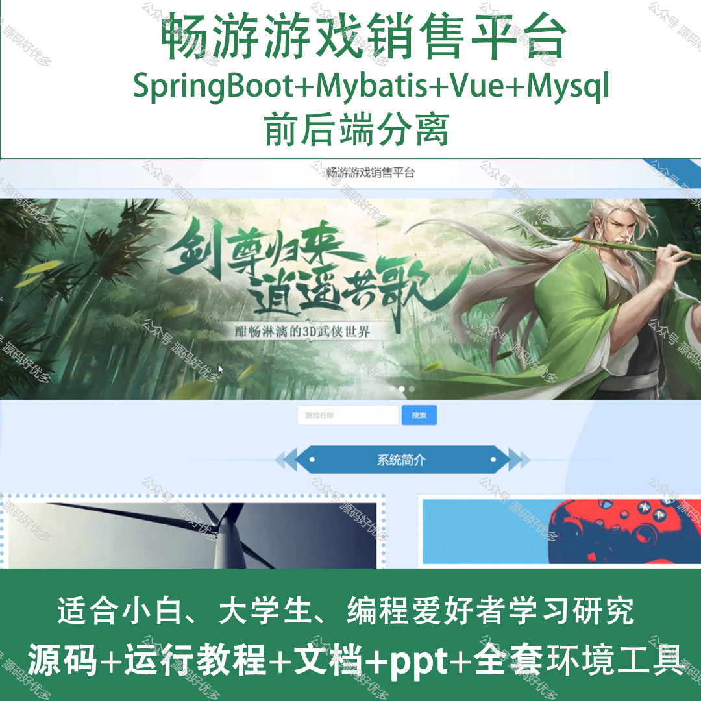
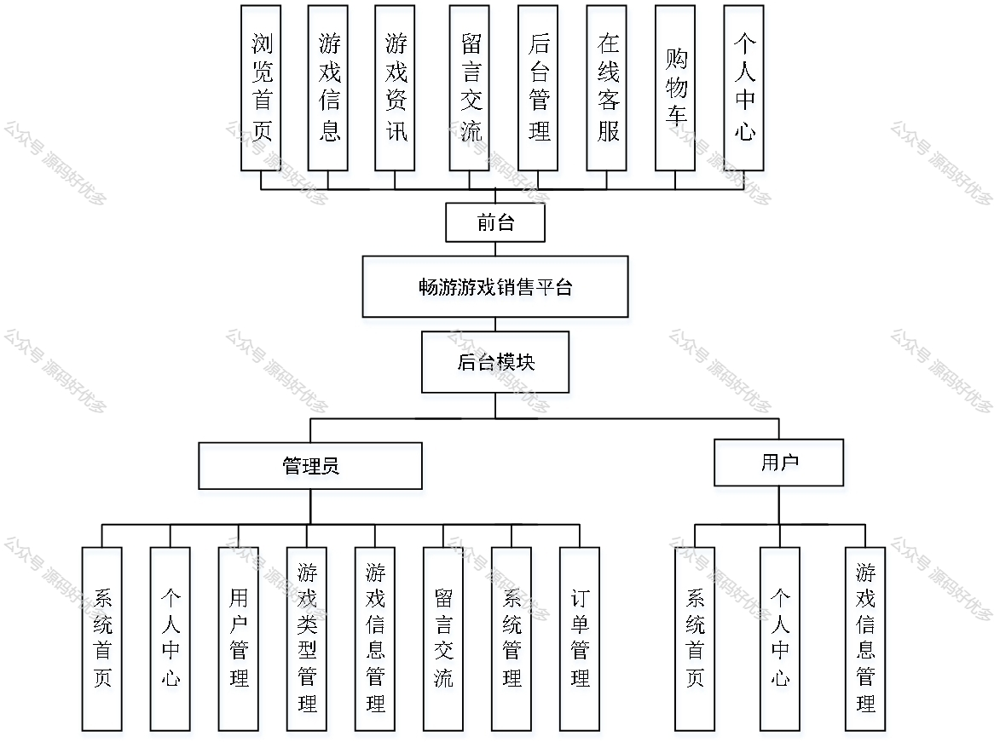
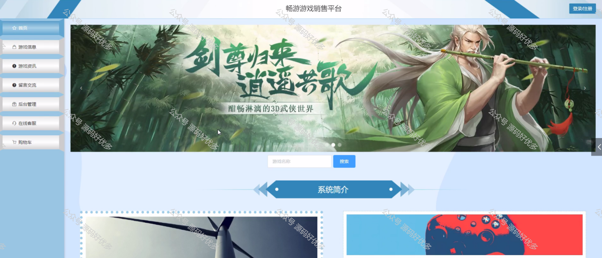
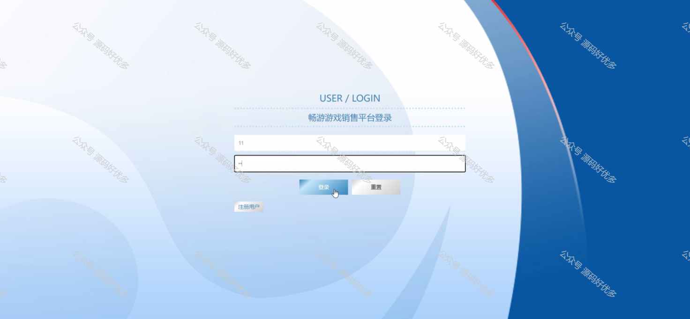
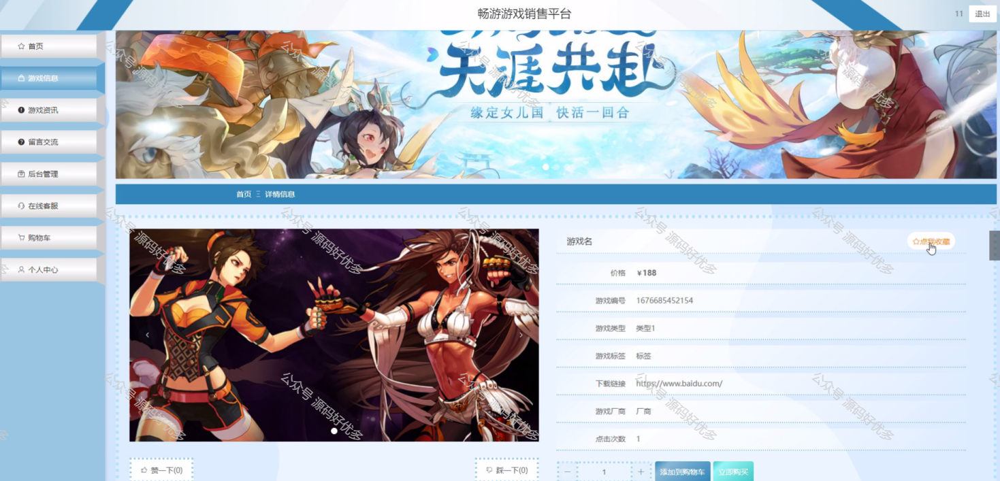
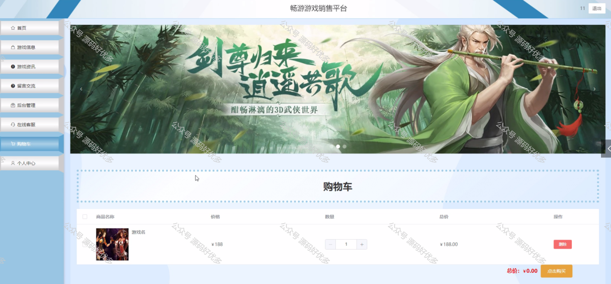
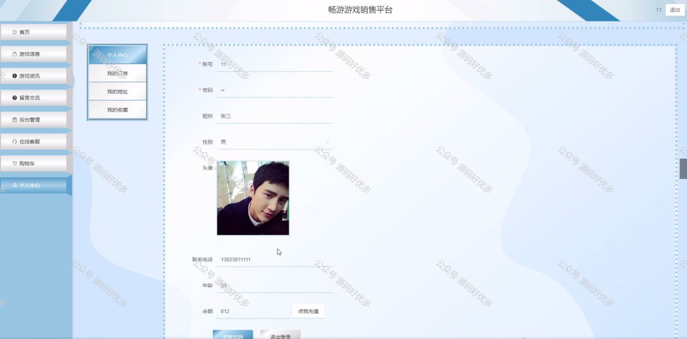
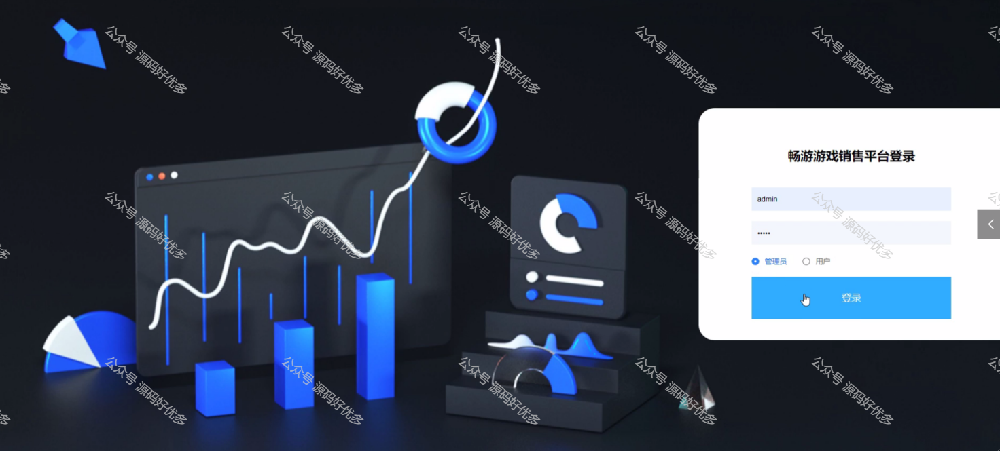
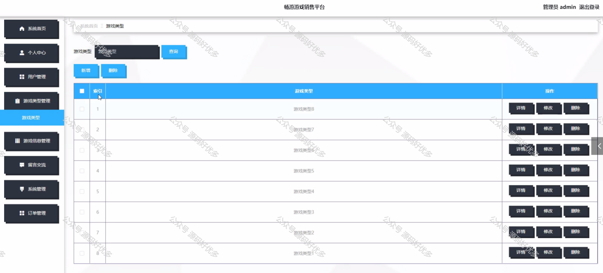
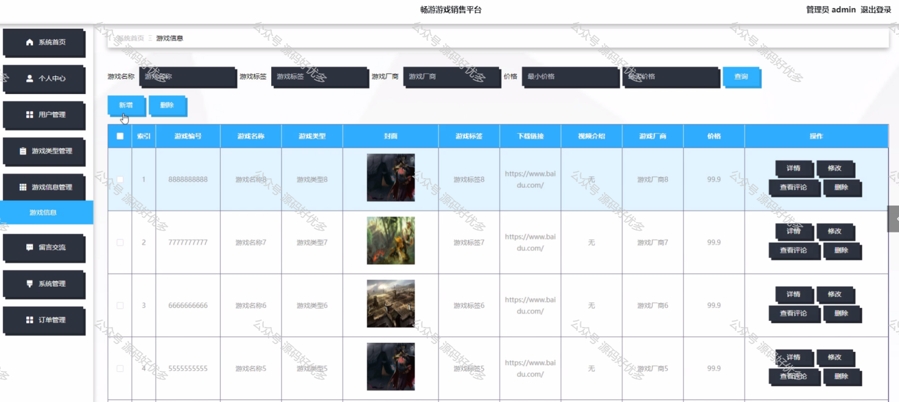
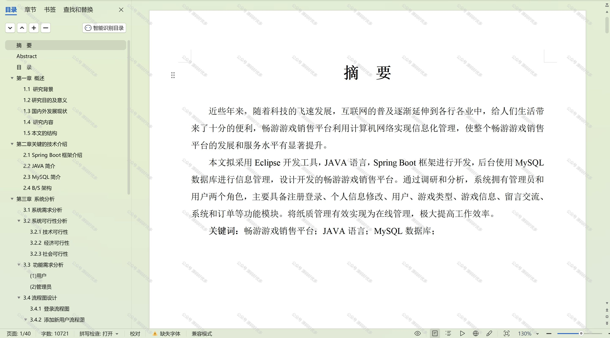

  
